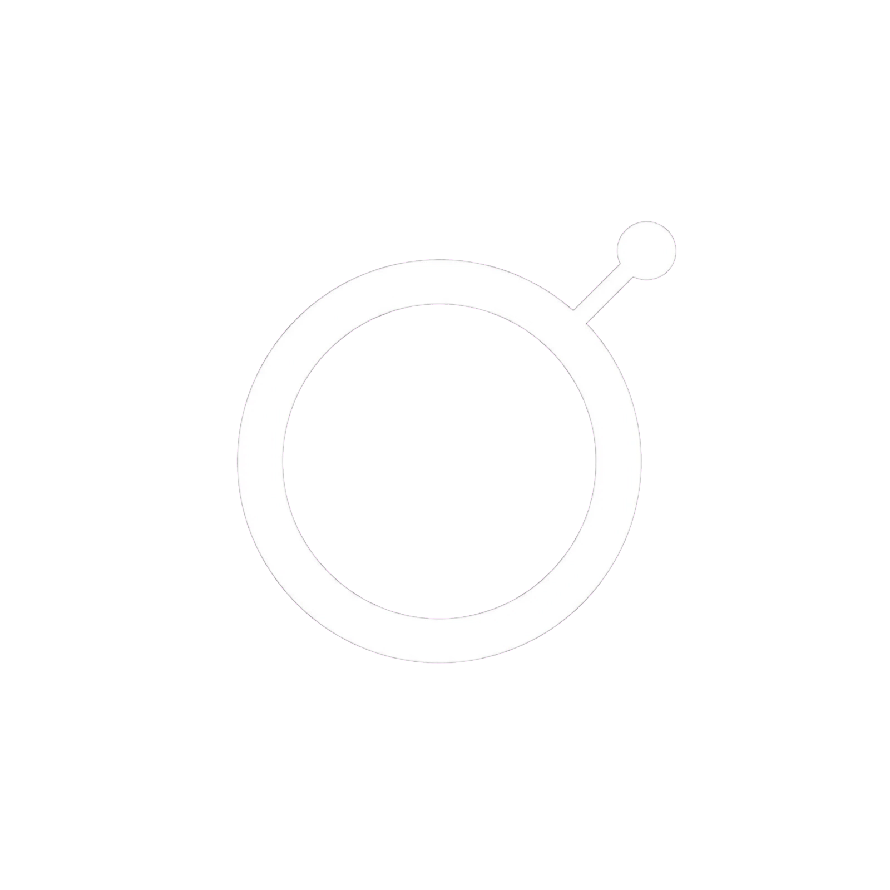
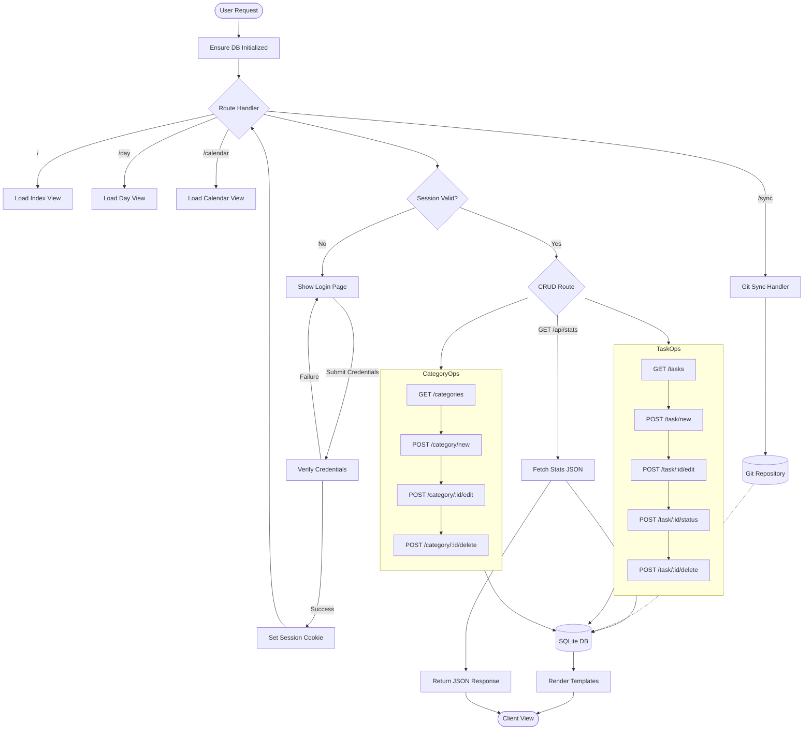
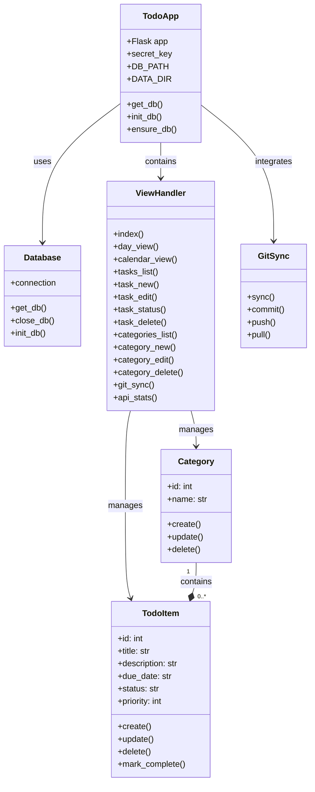
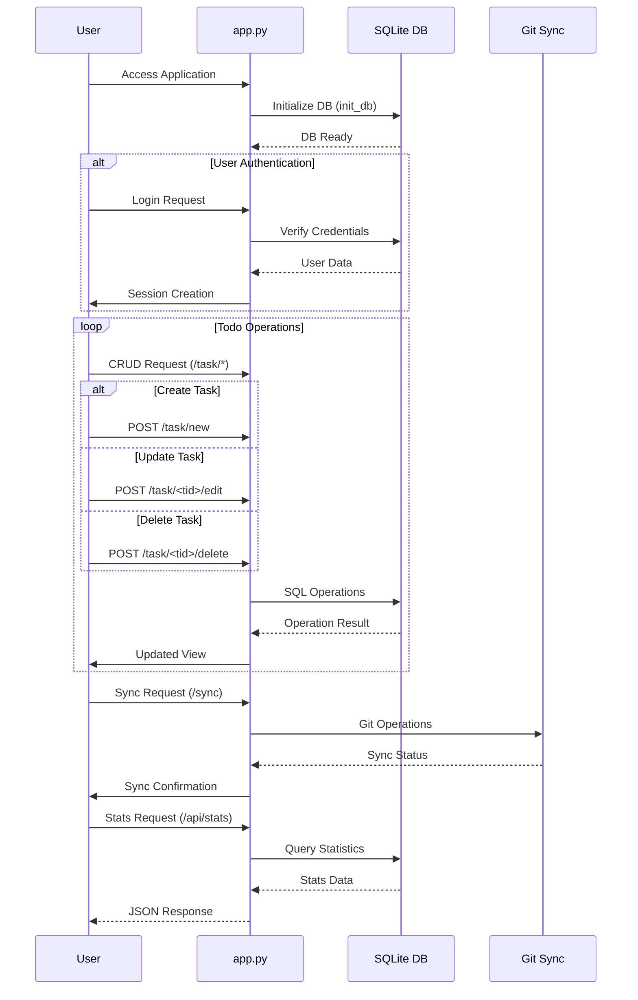

<p align="center">
  
</p>

# DAYMARK

A portable, single-process daily task workspace built with Flask, HTMX, and SQLite. Designed for local-first reliability, offline availability, and edge synchronization via Git.

---

## 1. Genesis & Narrative: The Architecture of Rehabilitation

For two years, the hustle went quiet. The version of me that learned relentlessly, shipped code without hesitation, managed complex systems, and stood anchored in deep personal discipline slipped away. In its place grew procrastination and the habit of leaning on others for momentum. 

That phase is over. 

DAYMARK is the instrument of recovery. It operates as an uncompromising supervision engine—a digital mirror enforcing radical transparency, tracking unrelenting deadlines, and demanding absolute accountability. Every database record and state transition is engineered to resurrect the rigorous work ethic and technical mastery of the past. 

No excuses. No safety nets. Total accountability. The work resumes now.

---

## 2. System Architecture & Flow

DAYMARK follows a modular monolithic architecture, combining server-rendered templates, hypermedia-driven interactions (HTMX), and a local-first SQLite persistence layer.

### System Flow Diagram (`flow.mmd`)



---

## 3. Data Model & Class Structure

The database schema consists of relational tables enforcing referential integrity, WAL mode, and optimized indexes.

### Class Diagram (`class.mmd`)



---

## 4. Request Interaction Sequence

DAYMARK uses HTMX to update task states without full-page reloads.

### Sequence Diagram (`sequence.mmd`)



---

## 5. Features & Capabilities

- **Day View**: Focus on maintenance for today or any specific date, featuring overdue task callouts and quick navigation.
- **Calendar Grid**: Month-at-a-glance view with task density indicators and direct day selection.
- **Task Management**: Create, edit, prioritize (1–4), assign statuses (`todo`, `doing`, `done`, `blocked`), and link tasks to categories.
- **Category Taxonomy**: Pre-seeded professional domains (Job, Learning, Research, Repos, Projects, Blogs, AI Engineering) with full CRUD support and custom icons/colors.
- **Git Sync**: Direct version control integration that commits `data/todo.db` and pushes/pulls changes across machines.
- **Notion-Inspired UI**: Warm neutral color palette, compact toolbars, clear typography (Inter), and keyboard-accessible form controls.

---

## 6. Project Structure

```text
todo-app/
├── app.py                 # Core Flask application and routes
├── design.md              # Design system tokens and UI specs
├── narrative.md           # Project genesis & rehabilitation story
├── thinking-process.md    # Strategic execution roadmap
├── flow.mmd               # System flow diagram source
├── sequence.mmd           # Interaction sequence diagram source
├── class.mmd              # ER / Class diagram source
├── requirements.txt       # Python dependencies (Flask)
├── data/
│   └── todo.db            # SQLite database file (git-tracked)
├── static/
│   ├── app.css            # Custom CSS design system
│   └── daymark_logo.png   # App insignia
└── templates/
    ├── base.html          # Root layout shell
    ├── day.html           # Daily task workspace
    ├── calendar.html      # Monthly calendar grid
    ├── categories.html    # Category management view
    ├── task_form.html     # Task create/edit form
    ├── sync.html          # Git synchronization dashboard
    └── partials/          # HTMX dynamic fragment templates
```

---

## 7. Quick Start

### Prerequisites
- Python 3.9+
- Git

### Installation & Execution

```bash
# Clone or navigate to the workspace
cd todo-app

# Create and activate virtual environment
python -m venv .venv
source .venv/bin/activate   # On Windows: .venv\Scripts\activate

# Install dependencies
pip install -r requirements.txt

# Start the application server
python app.py
```

Open [http://127.0.0.1:5000](http://127.0.0.1:5000) in your browser.

---

## 8. Git Edge Synchronization

Because DAYMARK stores tasks in a local SQLite file (`data/todo.db`), synchronization across multiple machines is handled directly through Git version control.

### Initializing Sync

```bash
git init
git add .
git commit -m "Initialize DAYMARK repository"

# Add your remote repository
git remote add origin <your-git-remote-url>
git push -u origin main
```

### Daily Workflow

1. **Commit & Push (from Machine A)**:
   ```bash
   git add data/todo.db
   git commit -m "sync: daily tasks update $(date +%Y-%m-%d)"
   git push
   ```
2. **Pull (on Machine B)**:
   ```bash
   git pull
   python app.py
   ```
   Alternatively, use the built-in **Sync** page in the application UI to inspect repository status and perform sync operations.

---

## 9. Technology Stack

- **Backend**: Python 3, Flask
- **Frontend**: HTML5, Vanilla CSS (CSS variables, flex/grid), HTMX for hypermedia interactions
- **Persistence**: SQLite 3 with WAL mode and foreign key enforcement
- **Versioning**: Git local-first database tracking
